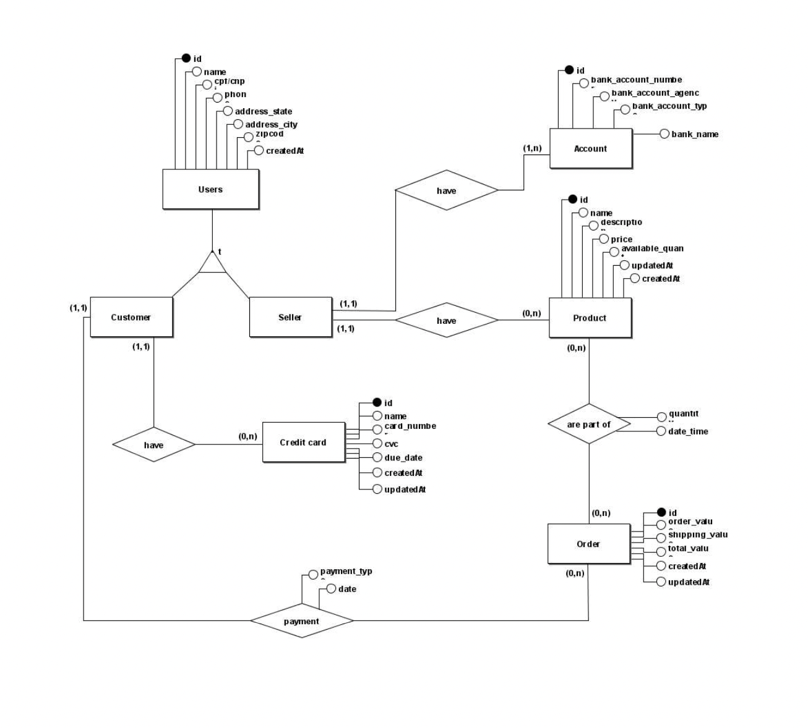

<h1 align="center" width="220px">
    E-COMMERCE
</h1>

  <a href="#rocket-tecnologias">Tecnologias</a>&nbsp;&nbsp;&nbsp;|&nbsp;&nbsp;&nbsp;
  <a href="#-projeto">Projeto</a>&nbsp;&nbsp;&nbsp;|&nbsp;&nbsp;&nbsp;
  <a href="#-como-executar">Como executar</a>&nbsp;&nbsp;&nbsp;|&nbsp;&nbsp;&nbsp;
  <a href="#-como-contribuir">Como contribuir</a>&nbsp;&nbsp;&nbsp;|&nbsp;&nbsp;&nbsp;
  <a href="#memo-licença">Licença</a>

 

  

 

## 🚀 Tecnologias

Esse projeto foi desenvolvido com as seguintes tecnologias:

- [React](https://reactjs.org)
- [TypeScript](https://www.typescriptlang.org/)
- [Node.js](https://nodejs.org/en/docs)
- [Knex.js](https://knexjs.org)

## 💻 Projeto

E-commerce é um sistema com frontend e backend desenvolvido para a cadeira Paradigmas de Linguagens de Programação. Tem como objetivo ser um produto de loja virtual, onde possui um backend monolítico com 5 classes referente a cada rota que o front irá consumir, sendo elas user, products, orders, cards e banckAccount. Contruido com Nodejs e Knexjs, usando sqlite3. Além disso, possui um frontend feito em React para consumir a Api Rest.

  

## :grey_question: Como executar

Para rodar o projeto em sua máquina é necessário ter npm ou yarn instalado, também deve ter o node 16. Após isso, basta baixar as dependências do projeto e executar os seguintes comandos:

- Passo 1: cd backend

- Passo 2: yarn install ou npm install

- Passo 3: cd ..

- Passo 4: cd web

- Passo 5: yarn install ou npm install

Obs.: Após baixar as dependências das 2 pastas, basta entrar nelas novamente e inserir os seguintes comandos no terminal

- Passo 6: cd backend -> yarn dev ou npm run dev

- Passo 7: cd web -> yarn start ou npm run start

## 🤔 Como contribuir

- Faça um fork desse repositório;
- Cria uma branch com a sua feature: `git checkout -b minha-feature`;
- Faça commit das suas alterações: `git commit -m 'feat: Minha nova feature'`;
- Faça push para a sua branch: `git push origin minha-feature`.

Depois que o merge da sua pull request for feito, você pode deletar a sua branch.

## :memo: Licença

Esse projeto está sob a licença MIT. Veja o arquivo [LICENSE](LICENSE) para mais detalhes.

---
